# MOOC Test in Week 11

1.  **算法中不允许 ：**

-   [ ] **A.**  多个输出
-   [ ] **B.**  多个输入
-   [x] ==**C.**  零个输出==
-   [ ] **D.**  零个输入

2.   **以下叙述中正确的是 ：**

-   [x] ==**A.** 局部变量说明为static的存储类，其生存期将得到延长==
-   [ ] **B.** 形参可以使用的存储类说明符与局部变量完全相同
-   [ ] **C.** 任何存储类的变量在未赋初值时，其值都是不确定的
-   [ ] **D.** 全局变量说明为static存储类，其作用域将被扩大

3.  **算法流程图中的菱形符号代表：**

-   [ ] **A.** 连接点
-   [ ] **B.** 一个加工
-   [x] ==**C.** 一个判断==
-   [ ] **D.** 程序开始

4.  **下面用流程图表示的算法完成的功能是：**

-   [ ] **A.** 计算 
-   [ ] **B.**  计算  
-   [ ] **C.** 计算 
-   [x] ==**D.** 计算==  

5.  :heavy_check_mark: **算法是编制程序代码之前对问题处理思想的一种描述，它与所采用的计算机语言无直接联系。** 

6.  :x: **评价算法的好坏主要用算法对内存的占用率。**

7.  :x: **语言的检查功能能够查出程序中的逻辑错误和语法错误。** 

8.  :x: **函数递归调用的深度可以根据功能需要任意增加。** 

9.  **快速排序的时间复杂度为** ) 

10.  **设一组初始记录关键字为(72，73，71，23，94，16，5)，则以关键字 72 为基准的一趟快速排序结果为 （只写数字，用空格分开，不加任何标点符号）** 